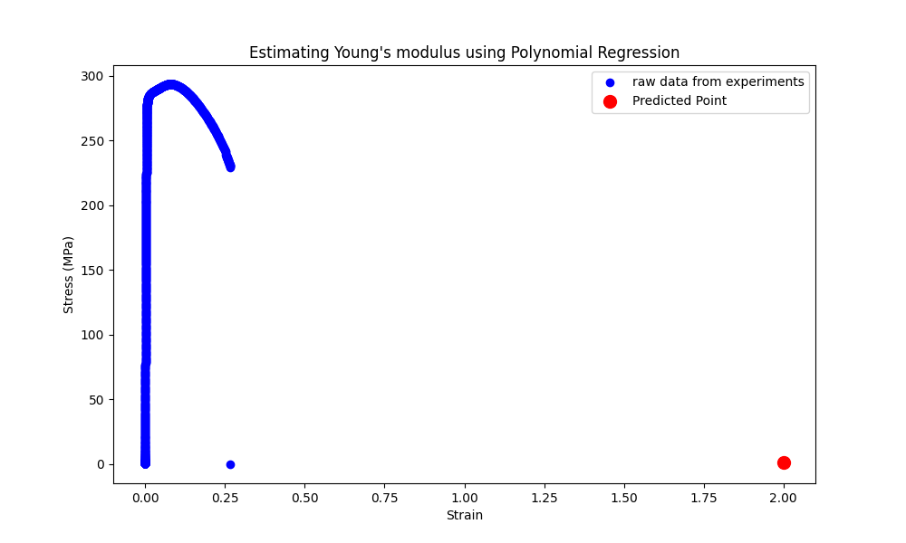

# Mechanics and Materials Introduction

Here the Overview of Stree and Strain study within code in Python

## Introduction

In the materials science and mechanics, comprehending how materials react to external forces is paramount. This comprehension forms the foundation for predicting material behavior under various circumstances, which is indispensable for engineering design and analysis. In this section, we will revisit the core concepts of stress, strain, and the mechanical behavior of materials.

## Stress and Strain

**Stress** is a pivotal mechanical property that characterizes how internal forces are distributed across a material's cross-section. It quantifies the intensity of these internal forces per unit area and is measured in N/m² (Pascals). Stress can be calculated using the equation:

$\[ \sigma = \frac{Force (F)}{Area (A)} \]$

Stress is crucial for understanding how materials respond to external loads and is a critical parameter for assessing strength and stability. It can be both tensile (stretching) and compressive (shortening) in nature.

**Strain** is a measure of the deformation that occurs within a material in response to applied forces or loads. It quantifies the change in size or shape of a material relative to its original dimensions.

## Predicting Object Failure

One of the advantage studying of stress analysis is predicting when an object will fail. For instance, consider a scenario where the maximum pressure applied to an object is $\( \sigma_y = 250 \, \text{MPa} \)$, which represents the failure stress. If we know $the cross-sectional area (\( A \))$ of the object, we can compute the force $(\( F \))$ required to induce this failure stress using the equation:

$\[ F = \sigma_y \times A \]$

## Stress-Strain Relationship

The interconnection between stress and strain is fundamental to grasping how materials perform under load. This relationship is conventionally depicted using a **stress-strain diagram**, a graphical representation of a material's response to escalating stress. The stress-strain diagram provides insights into a material's elastic behavior, yield point, plastic deformation, and ultimate failure.

## Hooke's Law

One of the primary principles governing the elasticity of materials is **Hooke's Law**, which asserts that the deformation (strain) of a material is directly proportional to the applied stress within the elastic limit. Mathematically, Hooke's Law can be formulated as:

$\[ \sigma = E \cdot \epsilon \]$

$where:
- \( \sigma \) represents the stress applied to the material.
- \( E \) denotes the Young's Modulus or Elastic Modulus, a material property indicating its stiffness.
- \( \epsilon \) signifies the strain experienced by the material.$

Hooke's Law is a fundamental concept for comprehending the initial behavior of materials within their elastic range. Beyond this point, materials undergo plastic deformation and might not return to their original state upon unloading.

## Prediction Point STRAIN using polynomial Regression 

The results are visualized by plotting the original stress-strain data points and the polynomial fit. The predicted point is marked on the graph using a red marker. Additionally, the predicted stress value at the next deformable point is printed.

